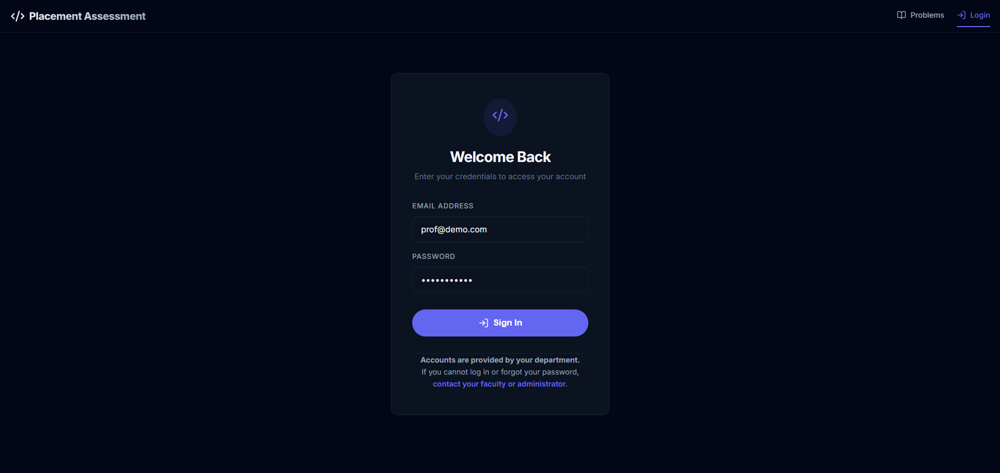
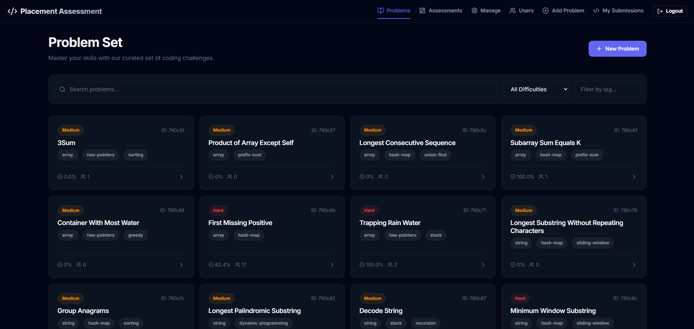
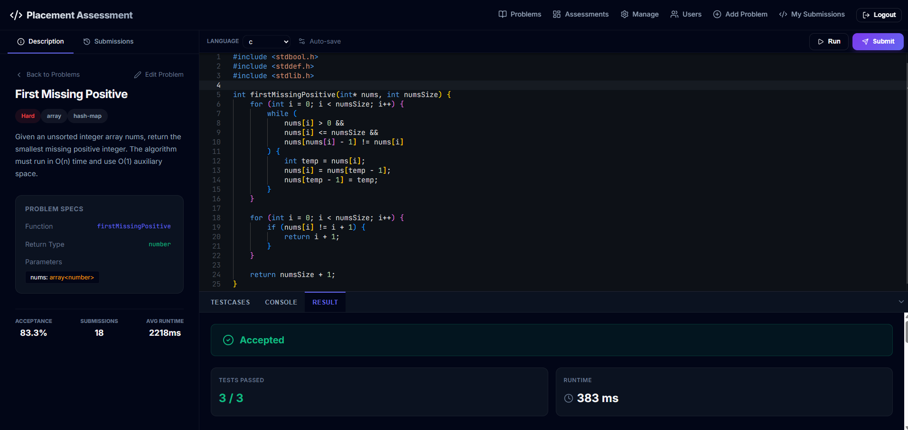
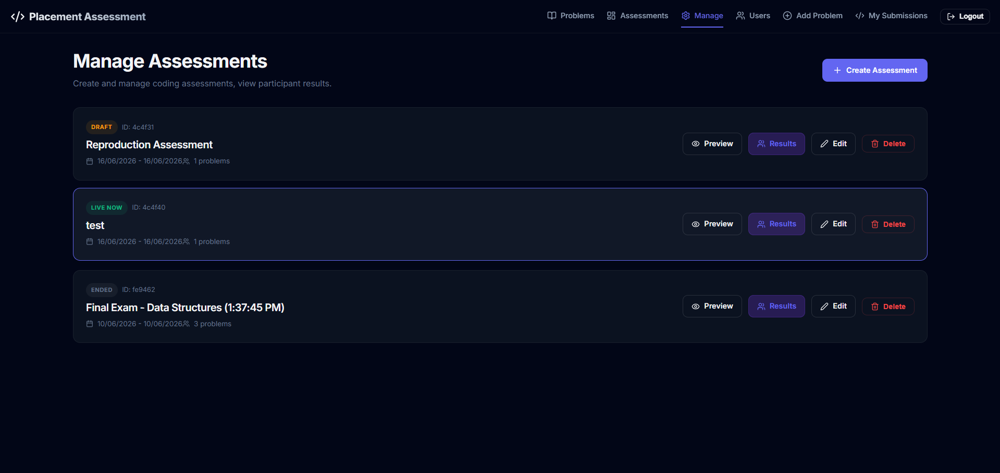
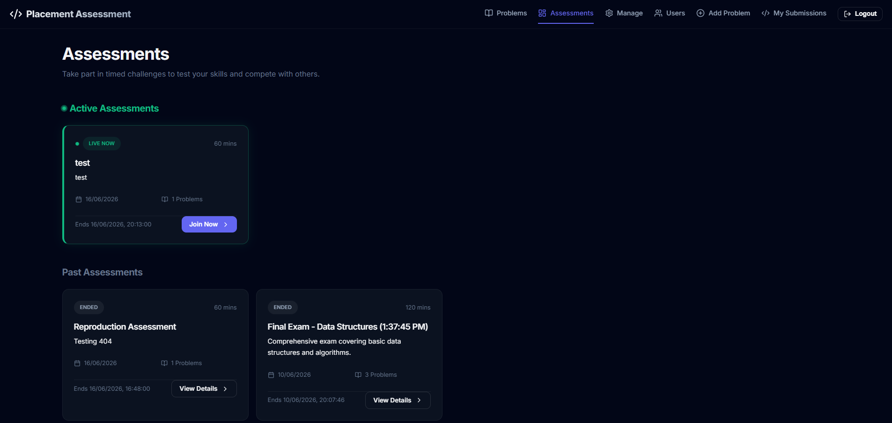
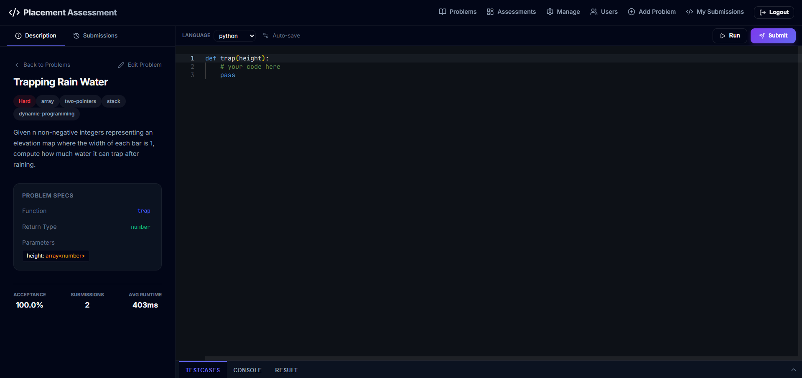
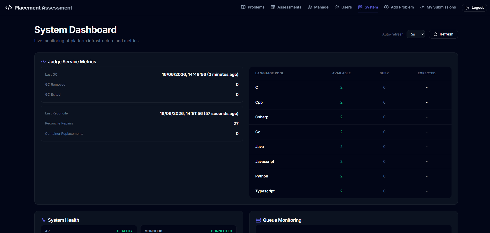
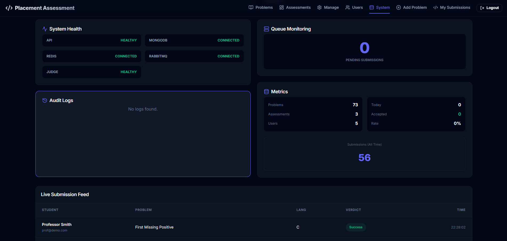
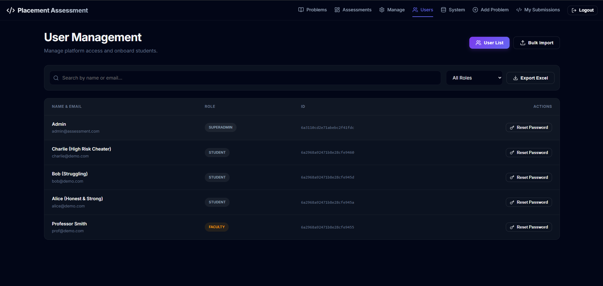

# 🏆 Coding Assessment Microservice Platform

A robust, enterprise-grade online judge and coding assessment platform. Designed for scalability, security, and high performance, this system allows organizations to host coding contests, evaluate student performance, and automate the grading of programming tasks across multiple languages.

## 🏗️ High-Level Architecture

The system follows a microservices architecture, leveraging asynchronous processing to handle resource-intensive code execution without blocking the main API.

- **`Frontend` (React 19 + Vite)**: A modern, responsive dashboard for students and faculty. Features include a powerful code editor (Monaco), real-time feedback, and comprehensive assessment management.
- **`Assessment API` (Node.js + Express)**: The central orchestrator handling user authentication, assessment lifecycles, problem management, and result aggregation.
- **`Judge Service` (Go)**: A high-performance execution engine that securely runs user code in isolated Docker containers. It uses **Container Pooling** to achieve near-zero cold-start latency.
- **`Infrastructure`**:
    - **Messaging**: RabbitMQ handles the asynchronous distribution of grading tasks.
    - **Persistence**: MongoDB for core data (users, problems, submissions); Redis for caching and real-time state.
    - **Security**: Strict container isolation, no-network access for user code, and resource quotas (CPU/Memory).

---

## ✨ Key Features

### 📝 Assessment Lifecycle Management
Supports the full journey of an assessment:
- **Drafting**: Faculty can curate problems, set scoring rules, and define time windows.
- **Live Mode**: Students participate in a secure environment.
- **Anti-Cheating**: Tracks tab switches, copy-paste events, and fullscreen exits. Shuffles problem order per student.
- **Auto-Grading**: Real-time evaluation of submissions with instant feedback.

### 🚀 High-Performance Judge (Go-based)
- **Container Pooling**: Pre-warms Docker environments for Python, Java, C++, JavaScript, and Go.
- **Central Compare**: Robust structural and exact comparison modes for complex return types (e.g., matrices, linked lists, trees).
- **Resource Management**: Uses `tmpfs` for lightning-fast file I/O and strict memory/CPU limits.

### 📊 Real-Time Monitoring & Admin
- **System Stats**: Live health monitoring of all microservices, queue lengths, and judge throughput.
- **Audit Logs**: Comprehensive tracking of all administrative actions.
- **User Management**: Bulk import students and manage roles (Student, Faculty, Admin).

---

## 📸 Screenshots

| Authentication | Student Dashboard | Problem Workspace |
|:---:|:---:|:---:|
|  |  |  |
| *Secure role-based login* | *Assessment overview* | *Interactive coding IDE* |

| Manage Assessments | Assessment Analytics | Monitoring Dashboard |
|:---:|:---:|:---:|
|  |  |  |
| *Lifecycle control* | *Performance tracking* | *Real-time status* |

| System Health (I) | System Health (II) | User Management |
|:---:|:---:|:---:|
|  |  |  |
| *Queue & Broker metrics* | *Judge service health* | *Role & Access control* |

---

## 🛠️ Technology Stack

| Layer | Technologies |
|:---|:---|
| **Frontend** | React 19, Vite, Tailwind CSS, Monaco Editor, Lucide Icons |
| **Backend API** | Node.js, Express, Mongoose, JWT, AJV (Schema Validation) |
| **Judge Service** | Go (Golang), Docker SDK, RabbitMQ AMQP |
| **Database** | MongoDB 6.0 |
| **Cache/State** | Redis 7.0 |
| **Infrastructure** | Docker, Docker Compose |

---

## 🚀 Getting Started

### Prerequisites
- [Docker](https://docs.docker.com/get-docker/) & [Docker Compose](https://docs.docker.com/compose/install/)

### Installation & Deployment

1. **Clone & Setup**:
   ```bash
   git clone https://github.com/Nakul-26/leetcode-clone
   cd assessment_microservice_2
   ```

2. **Environment Configuration**:
   Create a `.env` file in the root if you wish to use an external MongoDB (like Atlas):
   ```env
   MONGO_URI=mongodb+srv://...
   JWT_SECRET=your_secret_key
   ```

3. **Spin up the Cluster**:
   ```bash
   docker-compose up -d --build
   ```

4. **Seed Initial Data**:
   The system includes a certification seed for the Judge:
   ```bash
   # Run inside the assessment-api container
   docker exec -it codespace_assessment_api node scripts/seed_certification_set.mjs
   ```

### Accessing the Platform
- **Frontend**: [http://localhost:5173](http://localhost:5173)
- **API Docs (Swagger)**: [http://localhost:3000/api-docs](http://localhost:3000/api-docs)

---

## 🧪 Testing & Validation

### Submission Harness
Verify the end-to-end flow (API -> Queue -> Judge -> DB):
```bash
npm run test:submission
```

### Chaos & Soak Testing
Documentation for production-grade validation can be found in `docs/VALIDATION_PLAN.md`.

---

## 🧹 Maintenance

**Cleanup Docker resources**:
```bash
docker system prune -a -f
docker rm -f $(docker ps -aq)
```

---
